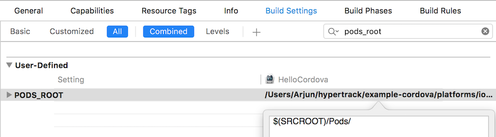
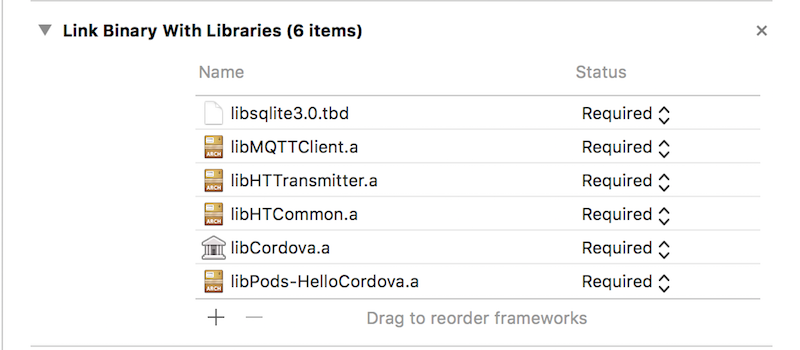
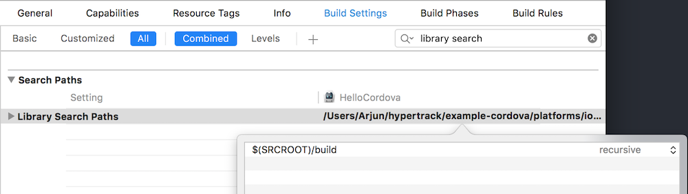

## Steps to configure iOS
This is an exhaustive list of changes, post which the the Cordova wrapper will be configured for iOS. Some of the steps might already be in place in your build process, and can be ignored.

In case you are stuck anywhere, please reach out to us on one of our support channels (elaborated below).


### 1. Setup the podfile with native dependencies
We will download the native SDKs using Cocoapods. In the iOS platform directory of your project, create a Podfile, and install the pods.

```shell
$ cd platforms/ios/
$ pod init # creates an empty Podfile

# edit the Podfile to look like
$ cat Podfile
platform :ios, '9.0'

target 'HelloCordova' do
  pod 'HTTransmitter'
end
```

After the Podfile has been configured, install the pods

```shell
$ pod install
```

Henceforth, use the `.xcworkspace` file to open the project in Xcode.


### 2. Fix PODS_ROOT path
With Cocoapods 1.1.1, the `PODS_ROOT` variable is not set in the Xcode project. To be able to build the project, this needs to be set manually. In the build settings of the project, add a user defined setting

```
PODS_ROOT = $(SRCROOT)/Pods
```



### 3. Build HyperTrack SDKs
To build the HyperTrack SDKs we installed from Pods, run the following command:

```shell
$ cordova build ios
```
In the output, verify that the SDKs were built by finding the following lines.
```
=== BUILD TARGET HTTransmitter OF PROJECT Pods WITH CONFIGURATION Debug ===
=== BUILD TARGET HTCommon OF PROJECT Pods WITH CONFIGURATION Debug ===
```


### 4. Add SDKs to linked libraries
In the project's general settings, ensure that you have the following libraries. The sqlite binary might have a different name, but it should work.



### 5. Fix library search path
Linking the library might not be enough, and the library search path might have to be modified so that Xcode can find the libraries while building. In your project's build settings, search for library search paths and modify the value.
```
Library Search Paths = $(SRCROOT)/build (recursive)
```



### 6. Edit project info for permissions
The SDK requires Location (When in Use) and Motion permissions to track locations and activity. iOS requires you to set a reason for these permissions, which is displayed on the dialog box to the user. In your project's info settings, add the following Keys, with relevant Values.
```
Key: Privacy - Location When In Use Usage Description, Value: Required to access location data. (or your reason)
Key: Privacy - Motion Usage Description, Value: Required to access activity data. (or your reason)
```


### 7. Build configuration for pods
Due to some reason, building on Cordova uses the debug configuration of our SDKs. To switch to release, edit the `platforms/ios/cordova/build-debug.xcconfig` file. Add `PRODUCTION` to `GCC_PREPROCESSOR_DEFINITIONS`.

```
GCC_PREPROCESSOR_DEFINITIONS = DEBUG=1 PRODUCTION
```

You will also need to edit other build configurations, like `build-release.xcconfig` if you have them in your project. Set the value to `PRODUCTION`

```
GCC_PREPROCESSOR_DEFINITIONS = PRODUCTION
```


### 8. Building for simulator vs device
Xcode randomly throws some errors on "incorrect architecture" for the pods when you switch from building for simulator to device or vice versa. To fix these, use `cordova build` to correct the architecture of the pods whenever you are switching.

```shell
$ cordova build --device # when building for device

$ cordova build # when building for simulator
```

Once the build has succeeded, we are ready to install the plugin and then use Xcode for subsequent builds.


## Support
For any questions, please reach out to us on [Slack](http://docs.hypertrack.io/) or on help@hypertrack.io. Please create an [issue](https://github.com/hypertrack/hypertrack-cordova/issues) for bugs or feature requests.
